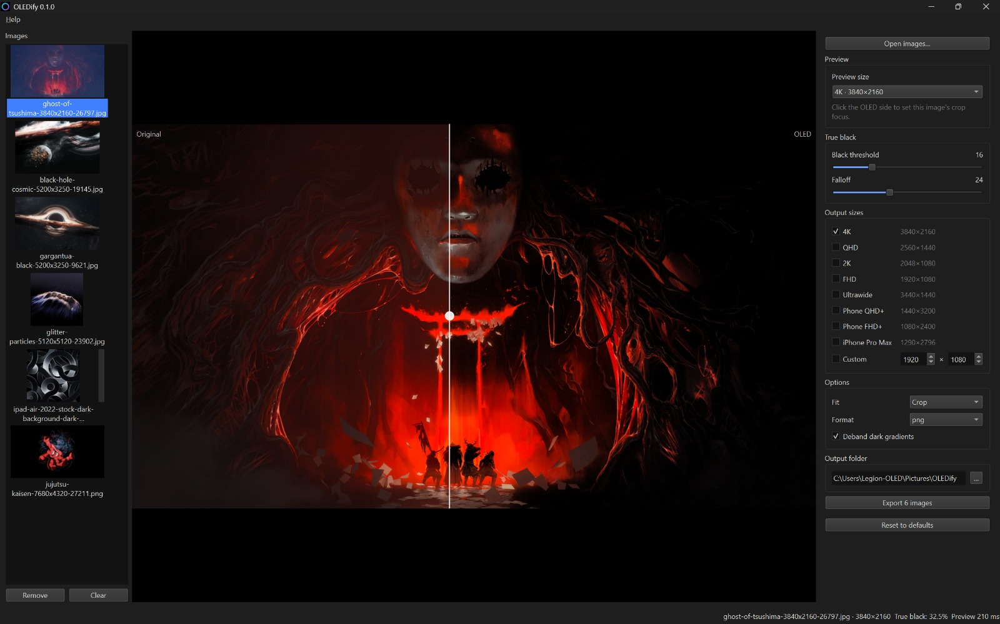

# OLEDify

Free, open-source Windows app that prepares any wallpaper for OLED and AMOLED screens.

OLEDify pushes near-black pixels down to true black (`#000000`) so those pixels switch off completely on an OLED panel, then resizes the image to your screen. Everything runs on your own computer: no AI, no accounts, no network access.


<!-- TODO: add assets/screenshot.png (main window with an image loaded) -->

## Features

- **True-black crush** with an adjustable threshold and a smooth falloff, so dark areas don't get a hard edge
- **Live before/after preview** with a draggable split line
- **Output presets**: 4K, QHD, 2K, FHD, Ultrawide, Phone QHD+, Phone FHD+, iPhone Pro Max, plus a custom size
- **Three fit modes**: crop to fill, black bars, or a blurred fill background
- **Click to set the crop focus** per image, so the right part stays in frame
- **Batch mode**: drop a folder in, export every image to every selected size
- **Debanding** to hide the banding that dark gradients often show
- **PNG, JPEG or WebP output**, with a quality setting for the lossy formats
- Warns when a preset would enlarge your source image
- Never overwrites: an existing file gets `_1`, `_2`, and so on

## Download

Grab the latest build from the [Releases page](https://github.com/rooman-dev/oledify/releases):

- **`OLEDify-Setup-<version>.exe`** — installer. Installs for the current user, so it needs no administrator rights.
- **`OLEDify-<version>-portable.zip`** — unzip anywhere and run `OLEDify.exe`.

Windows 10 or 11, 64-bit. The downloads aren't code-signed yet, so SmartScreen may warn on first run: choose **More info → Run anyway**.

## Does true black save battery?

Partly, but contrast is the real win. On an OLED screen a pure black pixel is switched off, so it emits no light at all: you get perfect blacks with no backlight glow, and the dark parts of a wallpaper look genuinely dark rather than dark grey.

Power savings are real but modest. They depend on how much of the image ends up pure black and how bright your screen is, and your wallpaper is usually covered by windows anyway. Treat any saving as a small bonus, not the reason to use this.

## Run from source

Requires Python 3.12.

```powershell
git clone https://github.com/rooman-dev/oledify.git
cd oledify
python -m venv .venv
.venv\Scripts\activate
pip install -e ".[dev]"
oledify
```

Run the tests (they're headless, so no window appears):

```powershell
pytest
```

## Build it yourself

```powershell
python scripts/build.py
```

This uses [Nuitka](https://nuitka.net/) to produce a standalone folder at `build/dist/OLEDify/`. To build the installer as well, install [Inno Setup 6](https://jrsoftware.org/isdl.php) and run:

```powershell
& "${env:ProgramFiles(x86)}\Inno Setup 6\ISCC.exe" /DMyAppVersion=0.1.0 installer\oledify.iss
```

The installer lands in `build/`. GitHub Actions does both automatically for every `v*` tag.

## How it's put together

- `src/oledify/core/` — image processing (Pillow + NumPy). No Qt in here, so it's testable without a display.
- `src/oledify/ui/` — PySide6 window, workers and widgets. All processing runs off the UI thread.
- `tests/` — pytest suite, including headless UI tests with pytest-qt.
- `scripts/` — icon generation and the Nuitka build.

## License

MIT © Rooman Ahmed. See [LICENSE](LICENSE).
